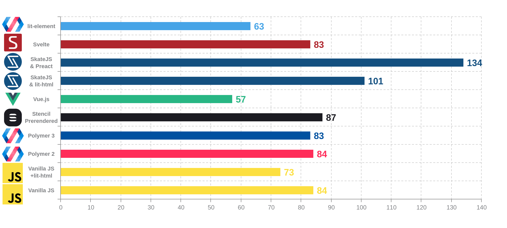

# Web components benchmark

Benchmarks of libraries and implementation of Web Components :

-   native
-   Polymer 3
-   Stencil
-   Vue.js
-   SkateJS
-   Svelte
-   lit-element
-   hyperHTML
-   riot
-   Dojo 2
-   Slim.js

The benchmark consists of two different applications :

-   TodoMVC implementation forked from [shprink/web-components-todo](https://github.com/shprink/web-components-todo)

-   Pascal triangle

# Requirements

Node.js

## Setup

> cd todomvc && npm i
> cd pascal-triangle && npm i

## Run for todos

In one tab

> npm run serve

In another tab

> npm run benchmark-create-todos

# Current results

## Pascal Triangle

TODO

## TodoMVC

### Page load (ms) - lower is better

### Create 50 items (ms) - lower is better

### Delete 50 items (ms) - lower is better

### Edit 50 items (ms) - lower is better

