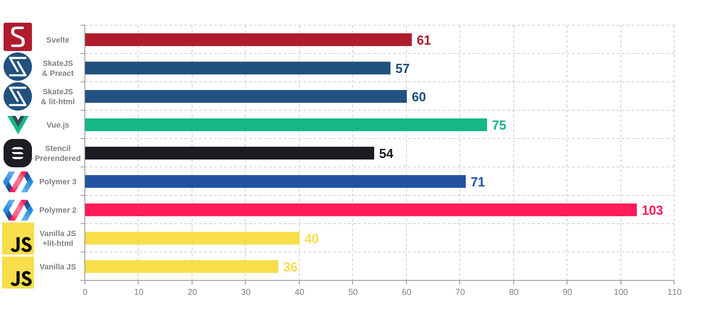
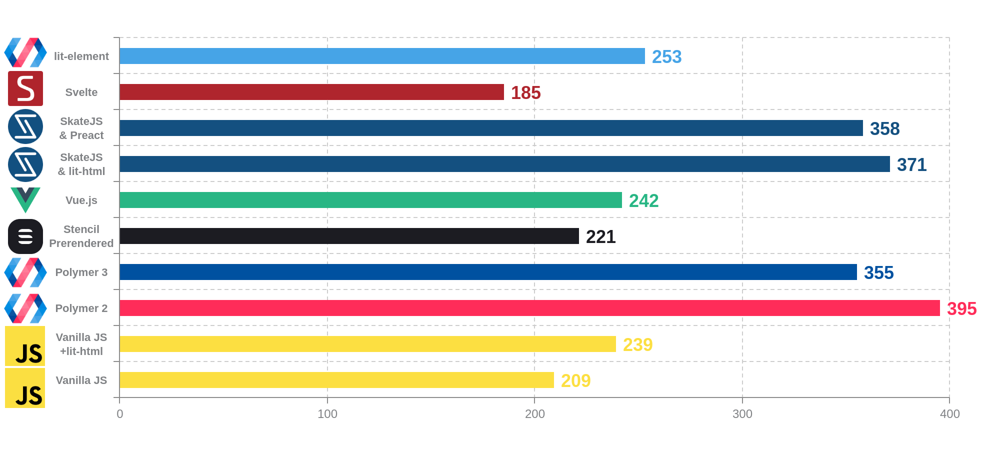
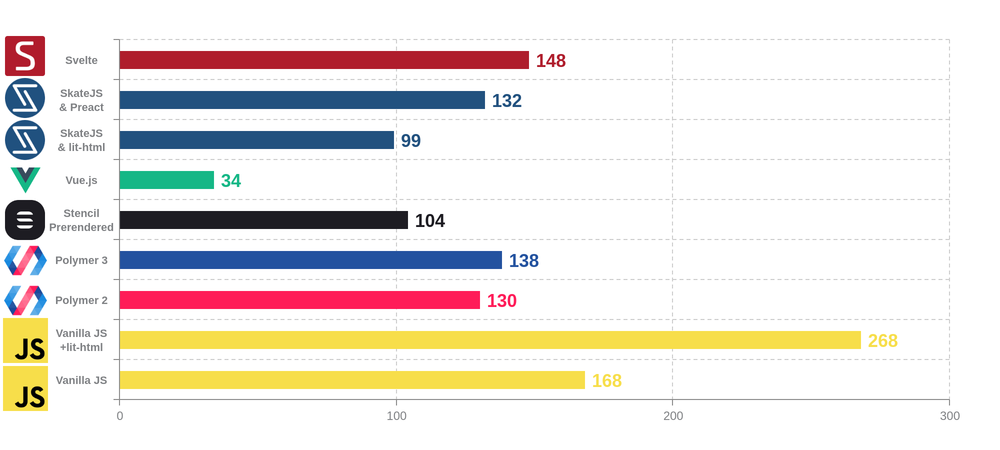
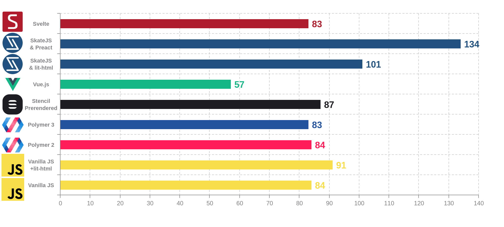

# Web components benchmark

Benchmarks of libraries and implementation of Web Components : Native, Polymer 2, Polymer 3, Stencil, Vue.js, SkateJS, Svelte, lit-element, lit-html, riot, stencil, Dojo 2

The benchmark consists of two different applications :

- TodoMVC implementation forked from [shprink/web-components-todo](https://github.com/shprink/web-components-todo)

- Pascal triangle

# Requirements

* `bower` and `polymer-cli` in global for polymer

> npm install -g bower
> npm install -g polymer-cli

## Setup

> npm i

## Run

In one tab

> npm run serve

In another tab

> npm run benchmark-create-todos

# Current results

## Pascal Triangle

## TodoMVC

### Page load (ms) - lower is better

### Create 50 items (ms) - lower is better

### Delete 50 items (ms) - lower is better

### Edit 50 items (ms) - lower is better

# TODOS

- [ ] add https://glimmerjs.com/guides/using-glimmer-as-web-components