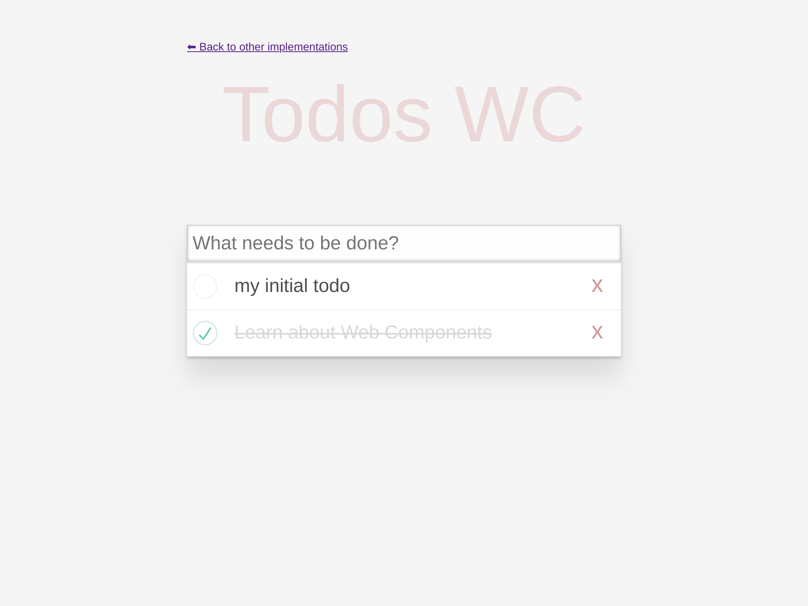
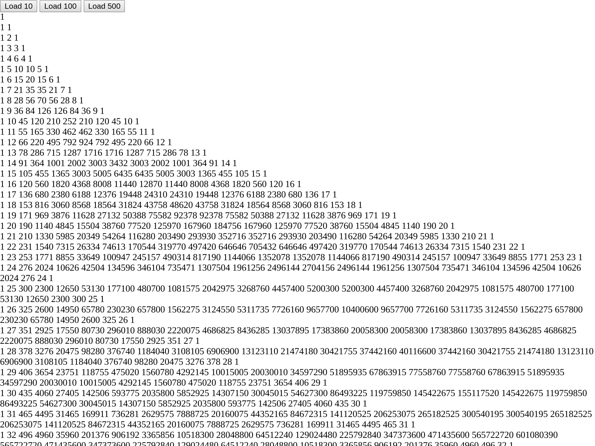

# Web components benchmark

Benchmarks of libraries and implementation of Web Components :

-   native
-   Angular Elements
-   Atomico
-   Dojo 2
-   hybrids
-   lit-element
-   hyperHTML
-   omi
-   Polymer 3
-   riot
-   SkateJS
-   Slim.js
-   Stencil
-   Svelte
-   Vue.js

The benchmark consists of two different applications :

-   TodoMVC implementation forked from [shprink/web-components-todo](https://github.com/shprink/web-components-todo)



-   Pascal triangle



# Requirements

Node.js

## Setup

```
> npm i
> cd todomvc && npm i
> bash install-all.sh
> npm run build:all
> cd pascal-triangle && npm i
> bash install-all.sh
> npm run build:all
```

## Run for todos

In one tab

```
> cd todomvc
> npm run serve
```

In another tab

```
> npm run run:benchmark
```

## Run for pascal-triangle

In one tab

```
> cd pascal-triangle
> npm run serve
```

In another tab

```
> npm run run:benchmark
```

# Current results

## TodoMVC

https://vogloblinsky.github.io/web-components-benchmark/#todo

# Current results

## Pascal triangle

https://vogloblinsky.github.io/web-components-benchmark/#pascal
